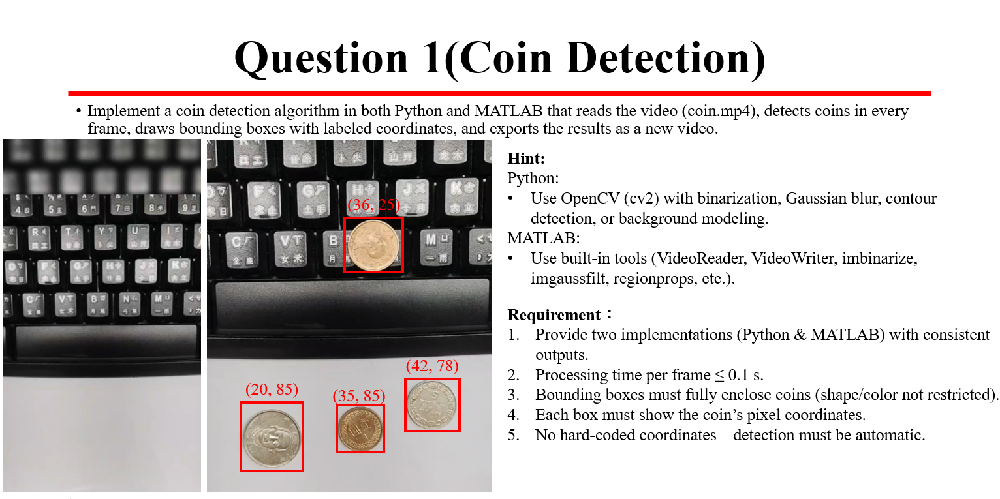
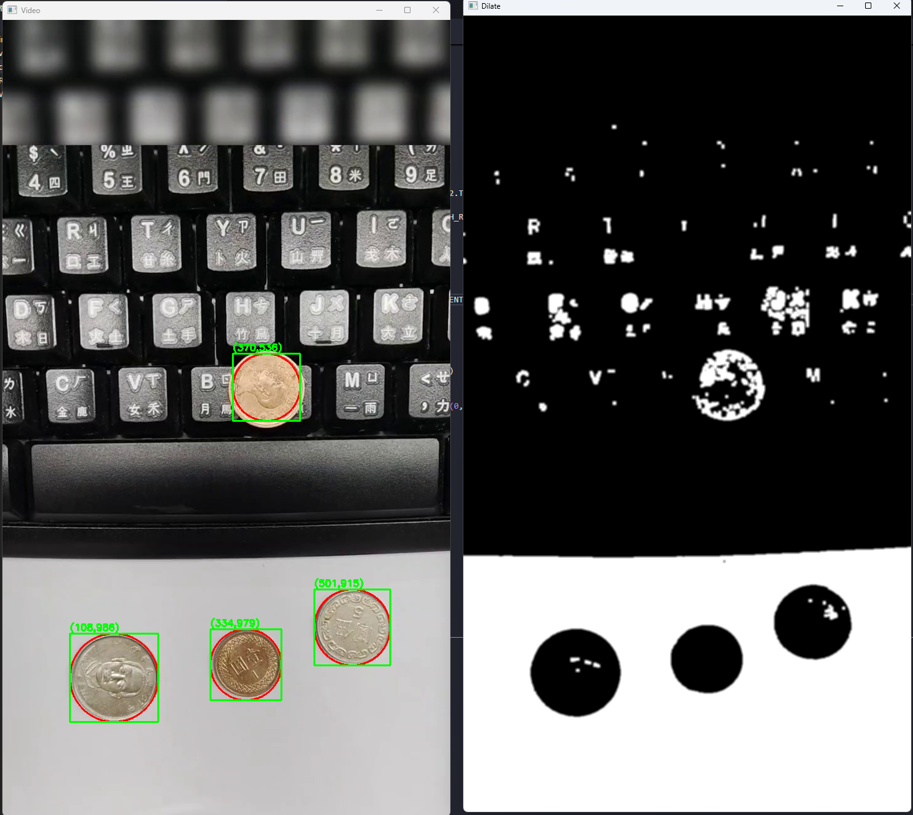

# Q1
### 辨識影片中的硬幣並繪製框線


### 主要CODE
```python

    轉換成灰階
    gray = cv2.cvtColor(img, cv2.COLOR_BGR2GRAY)   

    做二值化 閥值設在150 
    thresh, output = cv2.threshold(gray, 150, 255, cv2.THRESH_BINARY)
    
    設定膨脹侵蝕的kernal size (去除雜訊)
    erode_kernel = cv2.getStructuringElement(cv2.MORPH_RECT, (3,3))
    
    侵蝕
    erode = cv2.erode(output, erode_kernel)
    
    膨脹
    dilate = cv2.dilate(erode, erode_kernel)

    高斯模糊 (去除雜訊)
    output = cv2.GaussianBlur(dilate, (5,5), 2)

    霍夫圓轉換
    dp     = 每多少像素參與檢測 mindist = 圓心間最小距離 
    param1 = 裡面Canny的閥值   param2  = 被重複畫到多少次才判斷是圓心
    minRadius,maxRadius = 最小,最大圓半徑
    circles = cv2.HoughCircles(output,cv2.HOUGH_GRADIENT,dp=1.5,minDist=output.shape[0]//8,param1=100,param2= 50 ,minRadius=0,maxRadius=100)
```

### 左側為輸入影片及添加框後的影片 右側為前處理後的中途影片

