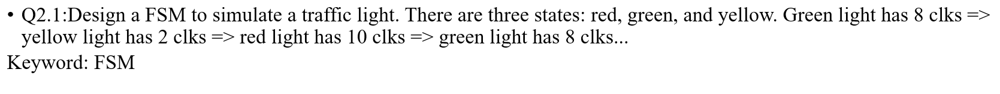
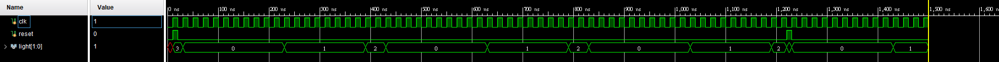

# Q2.1

### 設計一個紅綠燈 綠燈 8 clk 黃燈 2 clk 紅燈 10 clk
```verilog
設置燈的狀態
parameter state_close  = 2'd0, 
		  state_red    = 2'd1,
		  state_green  = 2'd2,
		  state_yellow = 2'd3;

燈的輸出
parameter red 	 = 2'd0,
		  green  = 2'd1,
		  yellow = 2'd2,
		  close  = 2'd3;

重置
always@(posedge clk or posedge reset)begin// reset
	if(reset) current_state <= state_close;
	else current_state <= next_state;
end

計數
always@(posedge clk)begin
	case(current_state)
	state_close: begin
                timer_red <= 0;
                timer_green <= 0;
                timer_yellow <= 0;
            end
	state_red:begin
				timer_red <= timer_red + 1; 
				timer_green <= 0 ;
				timer_yellow <= 0;
		   end
	state_green:begin
				timer_green <= timer_green + 1;
				timer_yellow <= 0; 
				timer_red <= 0;
		end
	state_yellow:begin
				timer_yellow <= timer_yellow + 1 ;
				timer_red <= 0 ;
				timer_green <= 0;
		end
	endcase
end

判斷是否達到秒數
always@(*)begin//current_state
	case(current_state)
	state_close: next_state = state_red;
	state_red  : next_state =(timer_red == 9)? state_green : state_red;
	state_green: next_state =(timer_green == 7)? state_yellow : state_green;
	state_yellow:next_state =(timer_yellow == 1)? state_red : state_yellow;
	endcase
end

控制輸出燈的狀態
always@(*)begin//light
	case(current_state)
	state_close: light = close;
	state_red  : light = red;
	state_green: light = green;
	state_yellow:light = yellow;
	endcase
```
##### 紅燈狀態為00 綠燈為01 黃燈為 10 
###Testbench
```verilog
    initial begin
		clk = 0;
		reset = 0;
	end
	
	initial begin
		#10 reset = 1;
		#10 reset = 0;
	    #1200 reset = 1;
		#10 reset = 0; 
	end
	
	initial forever #10 clk = ~clk;
	initial $monitor($time, " light = %b", light);
	initial #1500 $finish;
```
##### 紅燈:00 綠燈:01 黃燈:10 關閉:11



