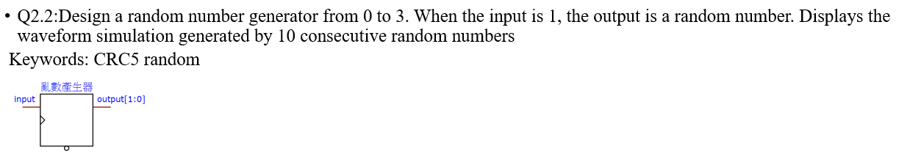
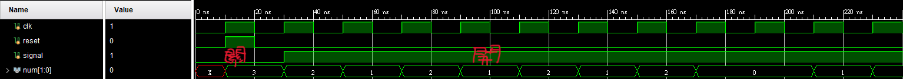
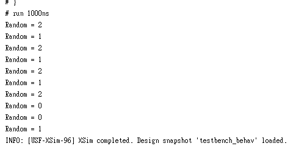

# Q2.2

### 設計一個隨機產生器 輸出在0到3

### 使用CRC8 來製作
##### 算式為 x^8 + x^2 + x +1
```verilog
assign temp = src[7] ^ src[1] ^ src[0];
```
```verilog
always@(posedge clk or posedge reset)begin
	if(reset)
		src <= 8'b10110101;  初始值(seed) 8'b10110101 取中間兩位做為輸出
	else if (signal)
		src <= {src[6:0] , temp};
end
```
```verilog
    initial begin
		clk = 0;
		reset = 0;
		signal = 0;
	end
	integer i;
	initial begin
		#10 reset = 1;
		#10 reset = 0;
        #10 signal = 1;
        
    
        for (i = 0; i < 10; i = i + 1) begin
            #20;
            $display("Random = %d", num);
        end
    end
```


##### 隨然取10個數中並沒有3 但在後續的模擬中是有的

