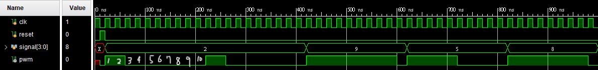

# Q2.3

### 設計一個PWM產生器 
### 輸入為1時 Duty Cycle 10% 輸入為2時 Duty Cycle 20% 以此類推 
```verilog
always @(posedge clk or posedge reset) begin
    if (reset)begin
        counter <= 0;
        current_state <= 0;
        flag <= 0;
        end
    
    計數到10或重置時
    else if (counter == 9 || flag == 0)begin
        counter <= 0;
        current_state <= signal;
        flag <= 1;
        end 
    else 
        counter <= counter +1;
end

判斷是否輸出
always @(*) begin
    if (counter < current_state)
        pwm = 1;
    else
        pwm = 0;
end
```
### Testbench
```verilog
    initial begin
        clk = 1;
        reset = 0;
    end
    
    initial begin
        #10 reset = 1;
        #10 reset = 0;
        
        signal = 2; 
        #100;
        
        signal = 9;
        #150
        
        signal = 5; 
        #200;
    
        signal = 8; 
        #200;
    end
```


###  如果中途給別的輸入

